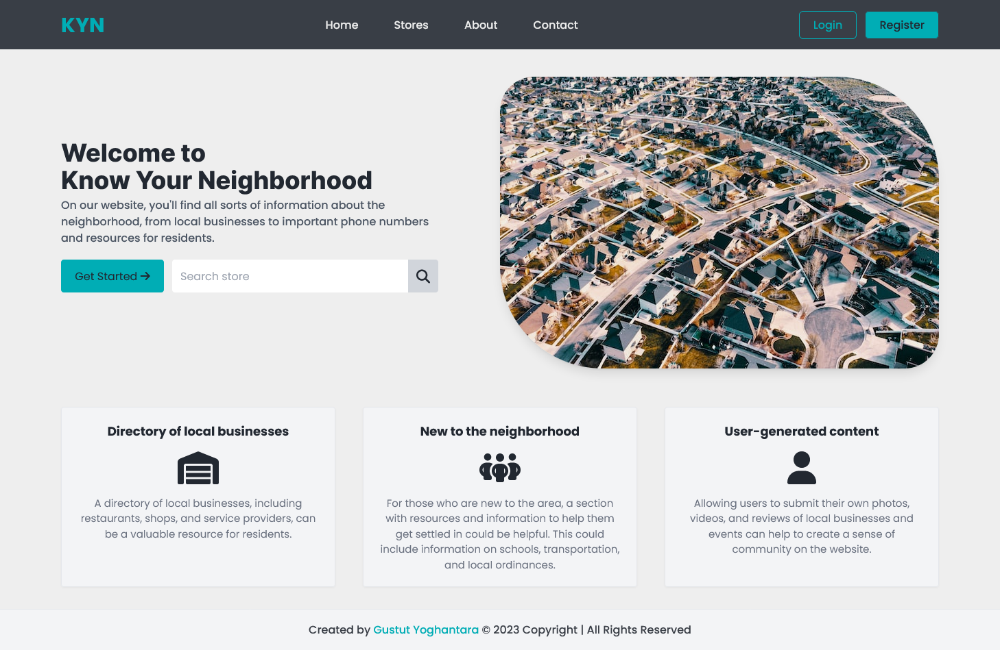
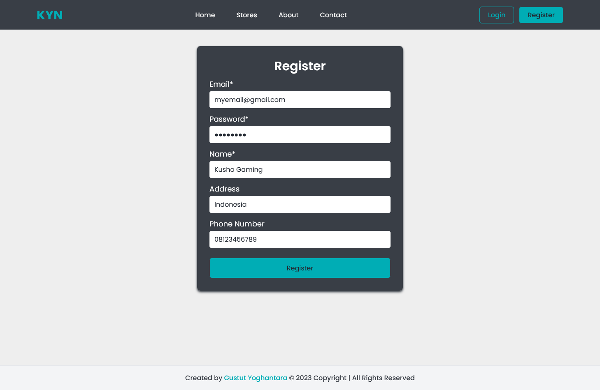
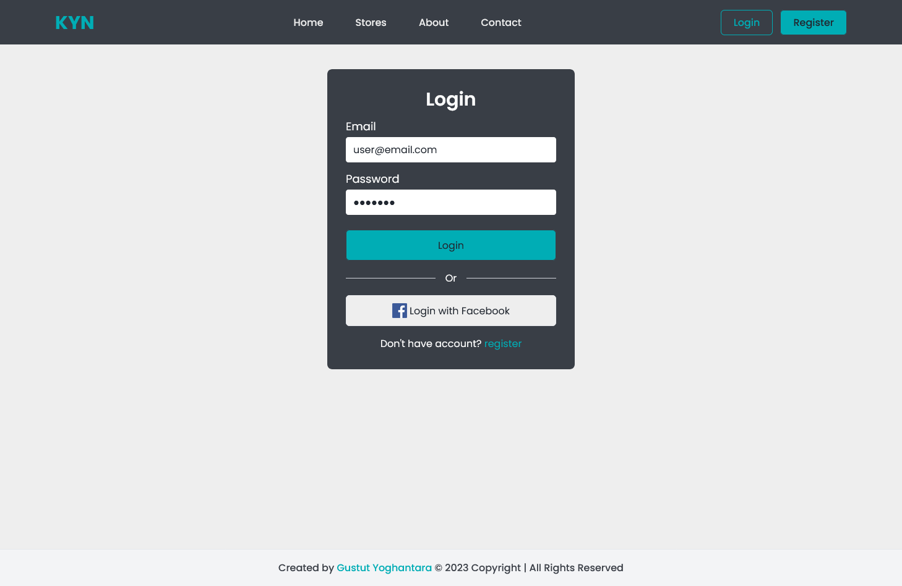
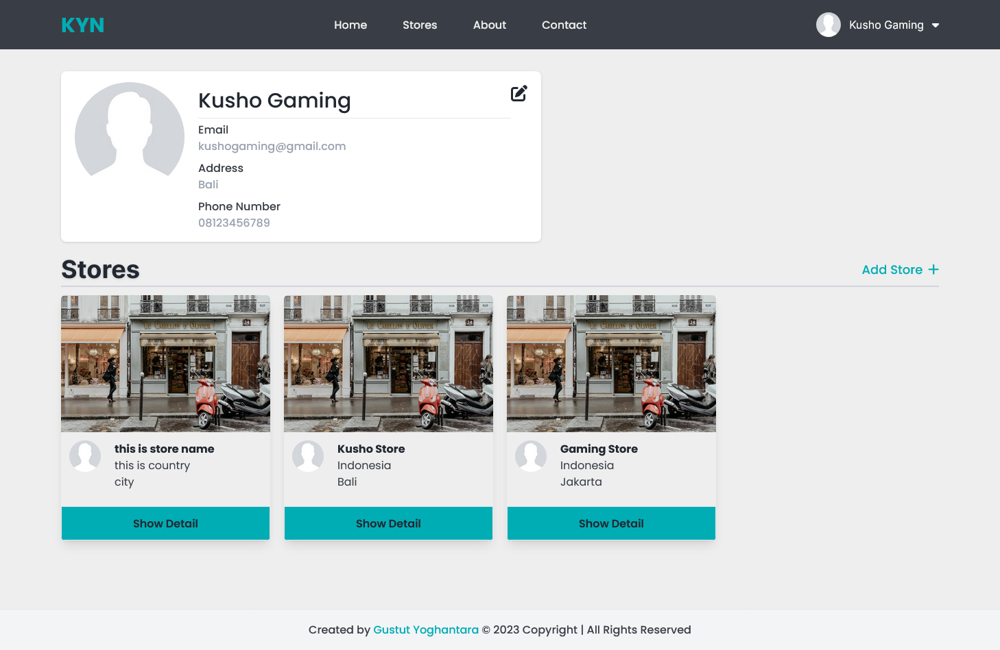
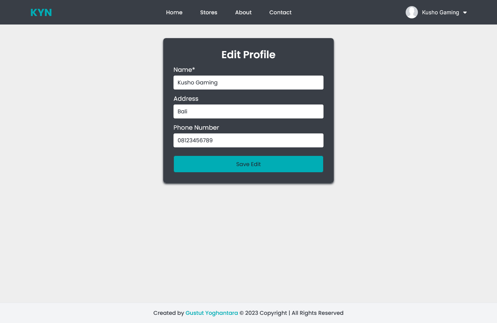
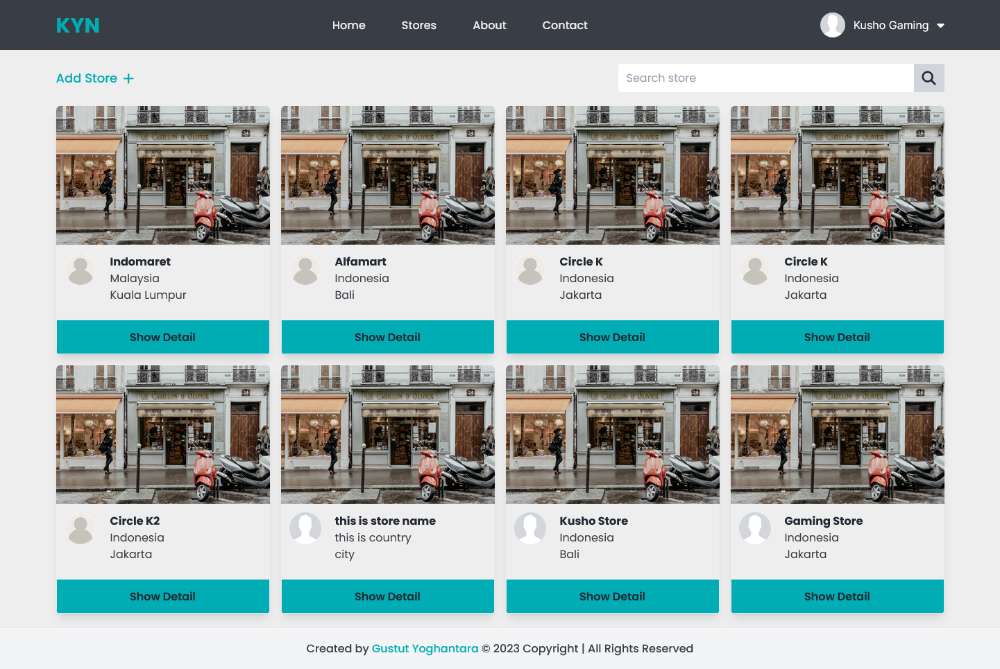
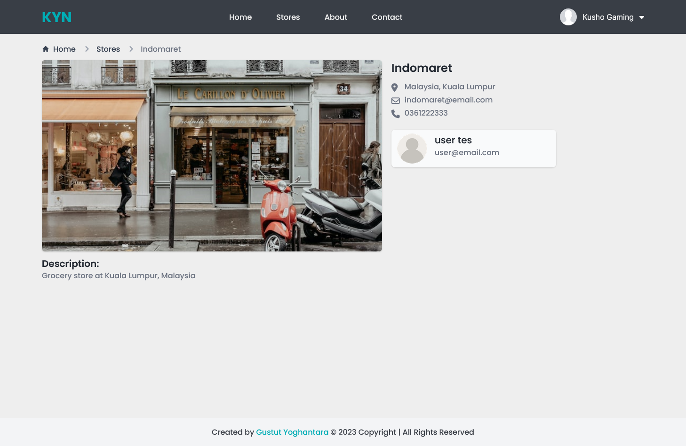
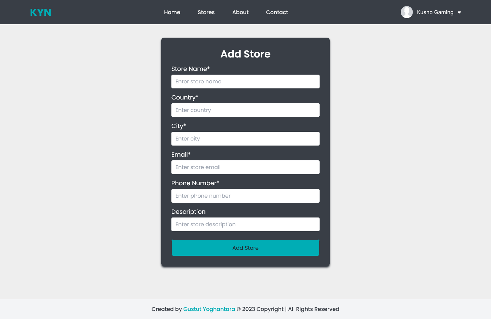
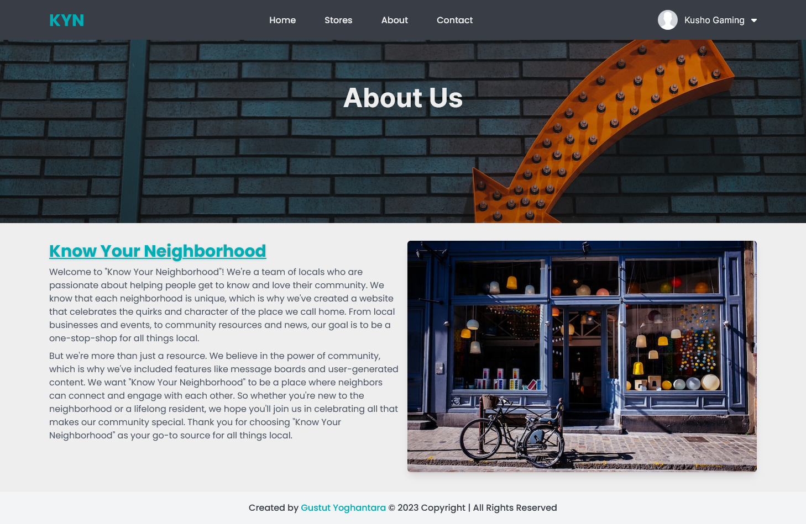
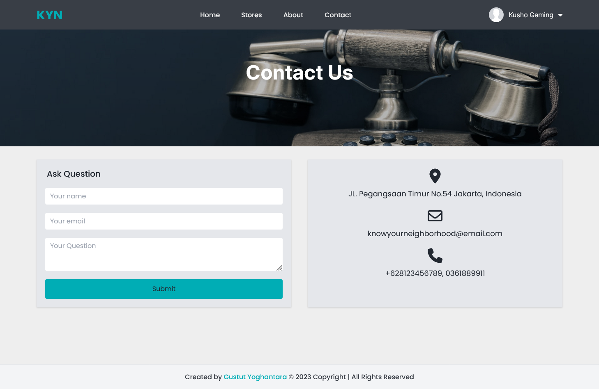

# Know-Your-Neighborhood

A website application that provides users with information about their local
neighborhood. The application allows user to register, login using their
Facebook account through OAuth2, post a store, search another store and
user, and edit their personal profile page

## Project Overview

The Know-Your-Neighborhood website consists of the following Key pages

1. Home Page
2. Registration Page
3. Login Page with social login (Facebook)
4. Contact us Page
5. About us Page
6. Stores Page
7. Store Detail Page
8. Post Store
9. View Profile page

Customers can login using the existing API and fetch basic information such as name, email from API.

## Technologies Used & System Requirements

Backend : Java SE 11, MySQL 8, Spring Boot, Spring Security, OAuth2 (Facebook API), Restful API <br/>
Frontend : React, Tailwindcss, Axios, React-hook-form, React-router-dom <br/>
Tools : Node Js (LTS Ver)

## HOW TO RUN

### Backend

1. **Import Existing Project into Visual Studio Code** <br/>
2. **Create MySQL database**

```bash
mysql> create database kyn
```

3. **Setup application.yml**

```yml
spring:
  datasource:
    url: jdbc:mysql://localhost:3306/kyn
    username: <YOUR_DB_USERNAME>
    password: <YOUR_DB_PASSWORD>

  jpa:
    show-sql: true
    hibernate:
      ddl-auto: update
    properties:
      hibernate:
        dialect: org.hibernate.dialect.MySQL8Dialect
  security:
    oauth2:
      client:
        registration:
          facebook:
            clientId: <YOUR_FACEBOOK_CLIENTID>
            clientSecret: <YOUR_FACEBOOK_CLIENTSECRET>
            redirectUri: http://localhost:8080/oauth2/callback/facebook
            scope:
              - email
              - public_profile
        provider:
          facebook:
            authorizationUri: https://www.facebook.com/v3.0/dialog/oauth
            tokenUri: https://graph.facebook.com/v3.0/oauth/access_token
            userInfoUri: https://graph.facebook.com/v3.0/me?fields=id,name,email,picture.width(250).height(250)

app:
  auth:
    tokenSecret: <YOUR_TOKEN_SECRET> (you can go to generator online for token secret)
    tokenExpirationMsec: 86400000
  oauth2:
    authorizedRedirectUris:
      - http://localhost:3000/oauth2/redirect
```

4. **Get Client ID & Client Secret Facebook API**

- <a href="https://developers.facebook.com/docs/facebook-login/">Facebook Docs to create Facebook Login endpoint API</a>

5. **Run Java Application**

### Frontend

1. **Import existing project to your Text Editor/IDE and run NPM Install**

```bash
npm install
```

2. **Run React application with NPM Start (Make sure the backend is also running in the localhost:8080)**

```bash
npm start
```

3. **Open [http://localhost:3000](http://localhost:3000) to view it in the browser.**

## Screenshot

<p>Home Page</p>

<p>Register</p>

<p>Login</p>

<p>Profile page</p>

<p>Edit Profile</p>

<p>Stores</p>

<p>Store Detail</p>

<p>Add Store</p>

<p>About Page</p>

<p>Contact Page</p>

